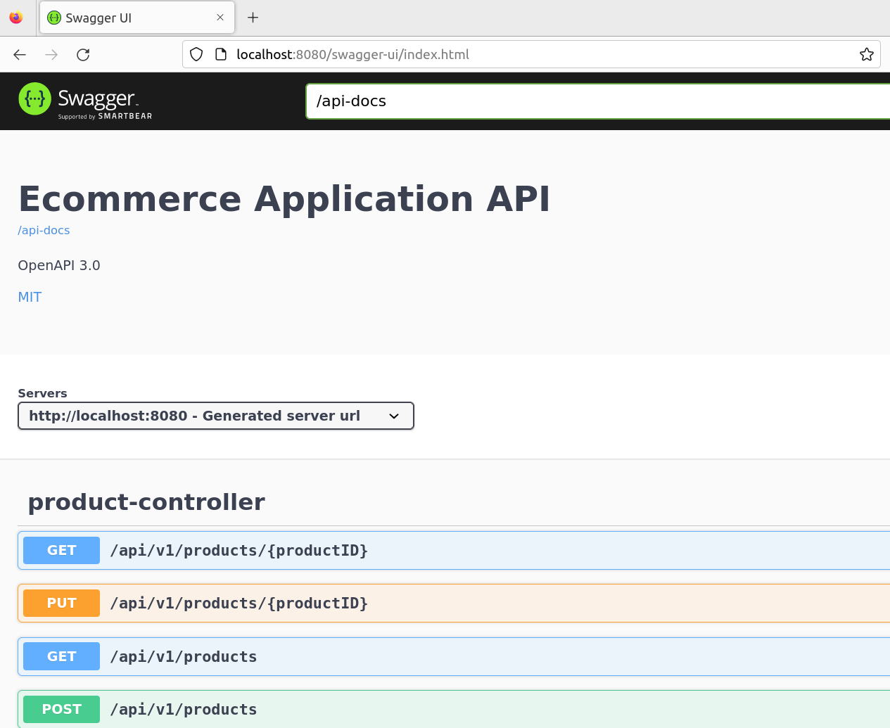
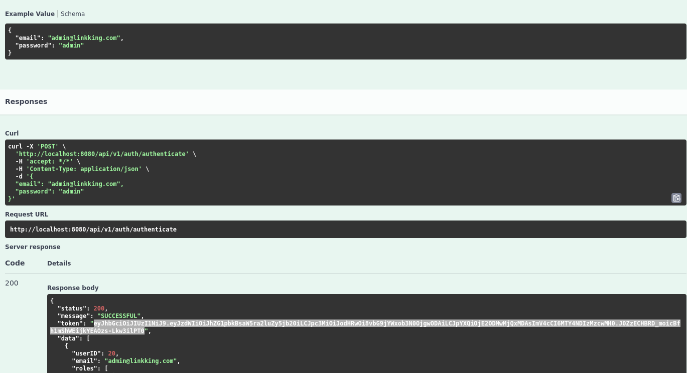
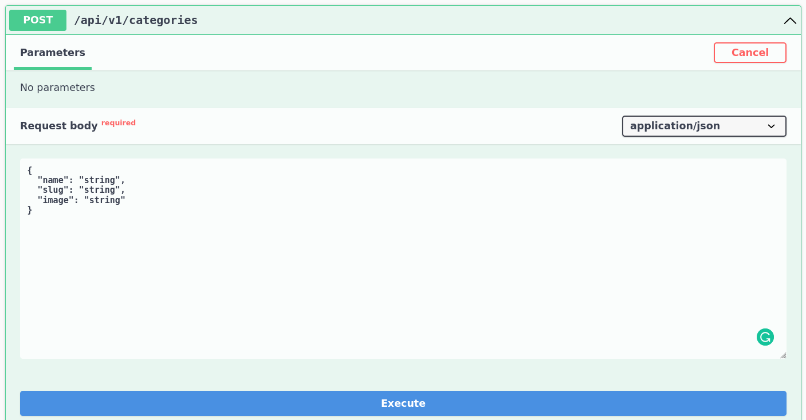

# API documentation

## Table of contents

- [Get started](#get-started)
- [Authentication](#authentication)
- [Json template](#json-template)
- [Read next](#read-next)

### Get started

Run the application and open **SwaggerUI** at http://localhost:8080/prod/swagger-ui/index.html

Use the **above link** to test and get detail information about APIs in this project **without to install Postman**.

## Authentication

When run the application, the **default user admin** is created with:

- username: `admin@linkking.com`
- password: `admin`

Any request to the API must be authenticated with **JWT token**.

Use the above credential to make a POST request to `/api/v1/auth/authenticate` to get the **JWT token**.

## Json template

All the json body template is included in SwaggerUI.

## Read next

Check out the [Role & Permission Documentation](./RolePermission.md) to see the list of public APIs, roles and permissions.
