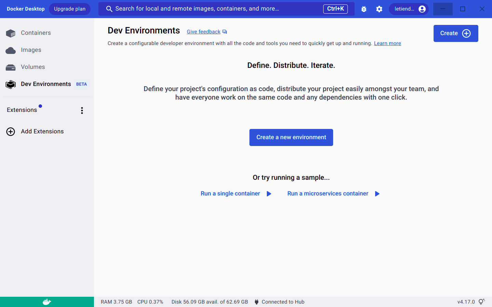
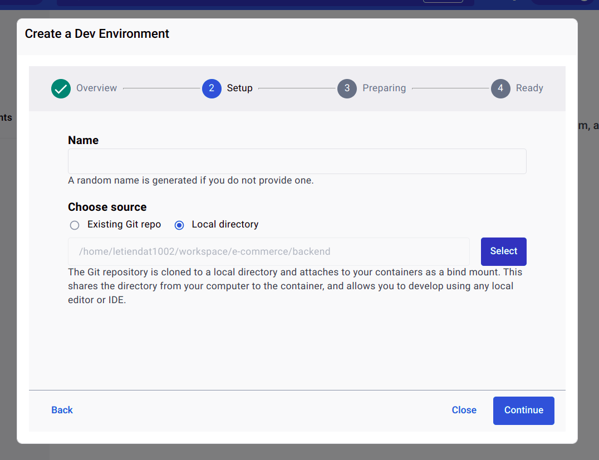
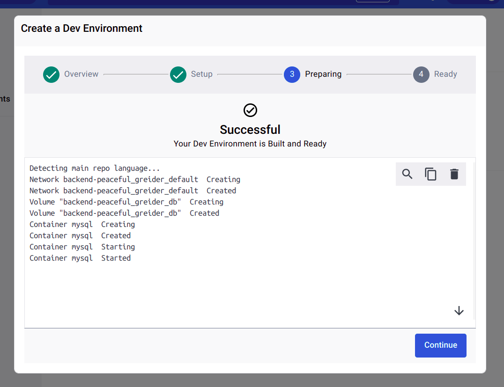
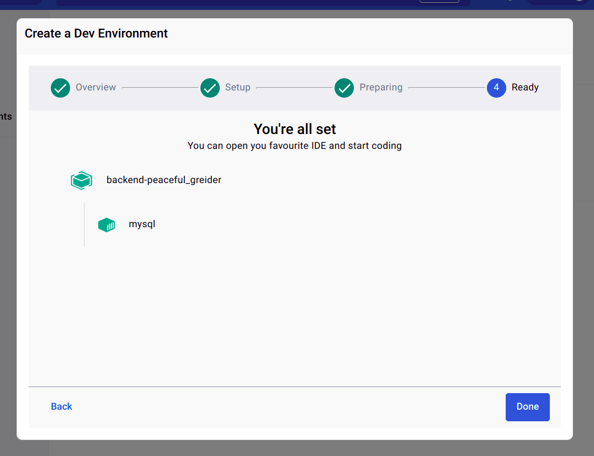
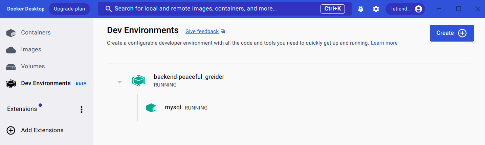
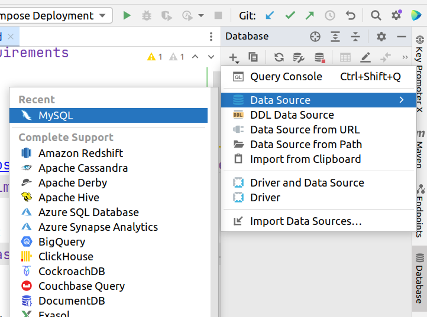
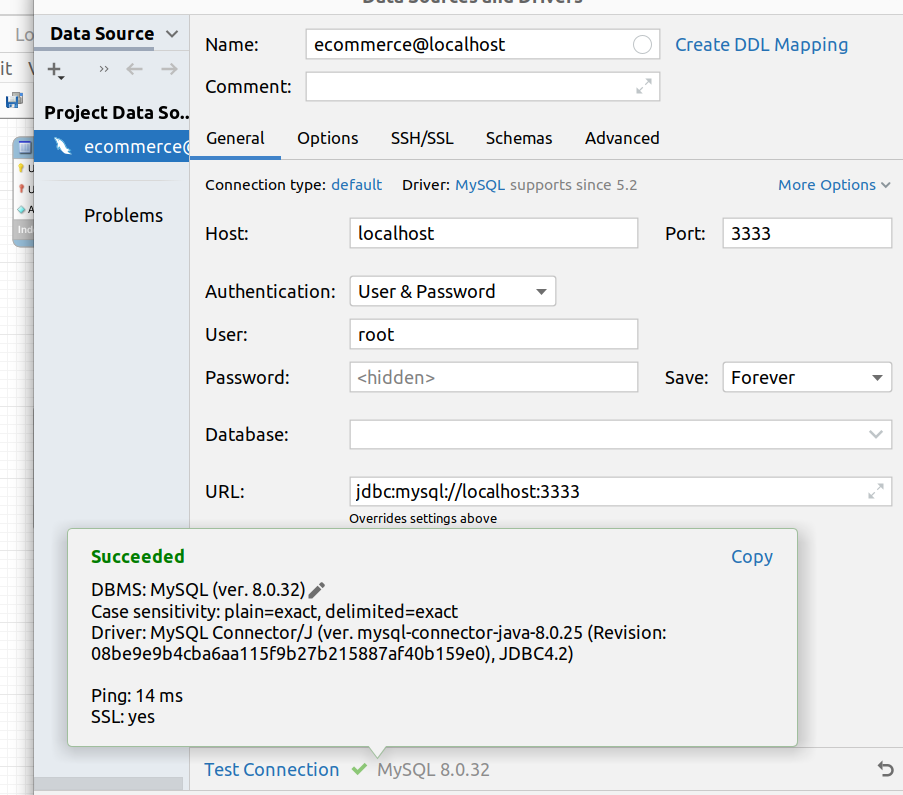
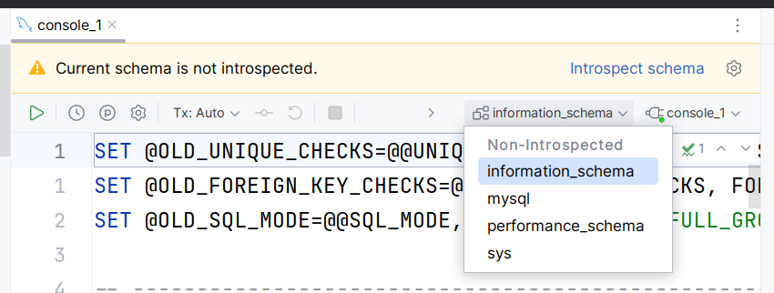
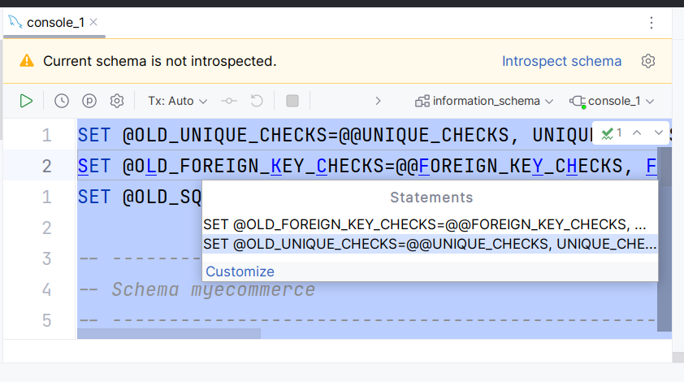
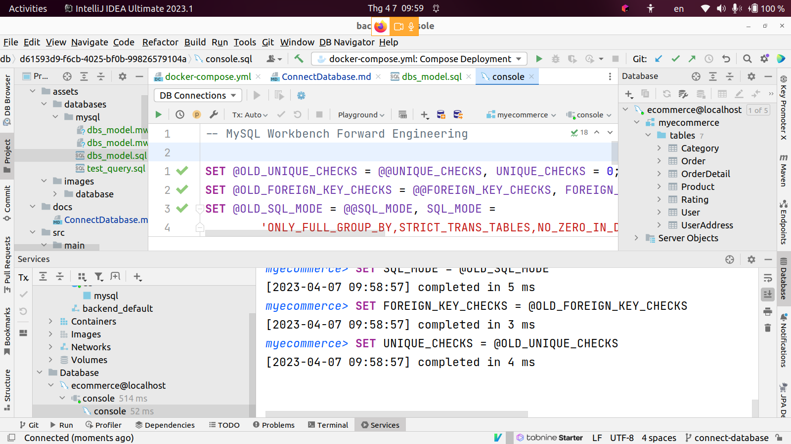

### Requirements
1. [Docker Desktop](https://www.docker.com/)

### Step By Step
1. Docker Desktop -> Dev Environments -> Create a new environment

2. Include these steps:
   1. On step 1, choose `Get Started`.
   2. On step 2, `Choose source` -> `Local directory` -> `Select` path to /backend -> `Continue`.

   

   3. Wait for Docker setting up successfully -> `Continue` -> `Done`.

   
   
   

3. Go to tab Database and connect to mysql server

- New -> Data Source -> MySQL

- Naming: ecommerce@localhost
- Port: 3333
- User: root
- Password: root
- Then Apply -> OK

- Copy all [dbs_model.sql](../assets/databases/mysql/dbs_model.sql) and paste to console tab.
  
  - Pick any database drop down 

> **No Console tab?** -> On tab Database, New -> Query Console (Ctrl + Shift + Q)

   - `Execute`(Ctrl + Enter)

Now you can work with the API. Check [APIs documentation](APIs.md) for more information.
