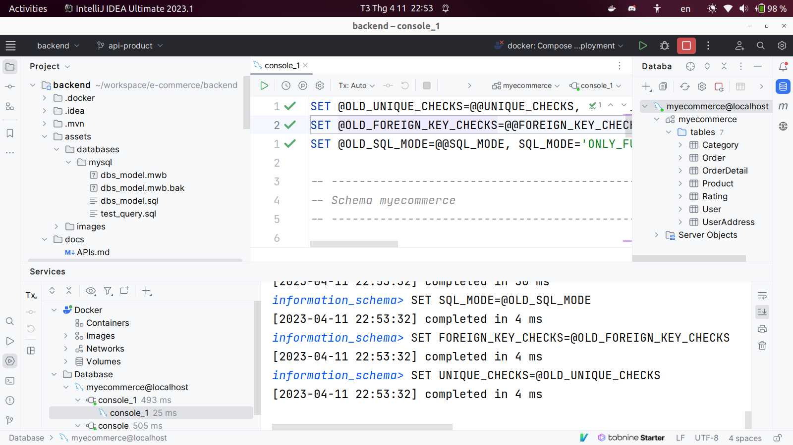

### IntelliJ Plugins Requirements
1. Docker

### Step By Step
1. Run file [docker-compose.yml](..%2Fbuild%2Fdocker-compose.yml)

    **Result:** (Message: ... ready for connections ... port: 3306  MySQL Community Server - GPL.)
    

2. Go to tab Database and connect to mysql server
- New -> Data Source -> MySQL

- Naming: ecommerce@localhost
- Port: 3333
- User: root
- Password: root
- Then Apply -> OK

- Copy all [dbs_model.sql](..%2Fassets%2Fdatabases%2Fmysql%2Fdbs_model.sql) and paste to console tab -> Execute

- On tab Database, New -> Query Console (Ctrl + Shift + Q), paste the below query then execute (Category API is not currently available):

    INSERT INTO myecommerce.Category VALUES (1, "laptop", "slug", "image");

- Now you can work with product API. Check [APIs documentation](APIs.md) for more information.

### Issues
1. [Fix soon] Data retrieves from Product API /get not in order (ProductID in bottom):

    {
        "name": "Laptop Asus ROG Strix Gaming G513IE-HN246W R7 4800H/8GB/512GB/15.6FHD/GeForce RTX 3050 Ti 4GB/Win 11",
        "status": true,
        "description": "ASUS ROG Strix Gaming G513IE-HN246W tập trung vào sức mạnh và trải nghiệm chơi game nhưng cũng không kém phần thu hút bởi thiết kế cao cấp, đèn LED ấn tượng. Mạnh mẽ ở cả CPU Ryzen 7 4800H và GPU RTX 3550 Ti, ROG Strix G513IE-HN246W hoàn hảo cho cả chơi game và làm việc đa nhiệm.",
        "categoryID": 1,
        "slug": "Asus-ROG-Strix-Gaming-G513IE-HN246W",
        "image": "",
        "unitPrice": 26990000,
        "quantity": 9999,
        "yearRelease": "2022",
        "manufacturer": "Asus",
        "monitor": "15.6 inch, 1920 x 1080 Pixels, IPS, 144 Hz, 250 nits, FHD",
        "cpu": "Amd ryzen 7",
        "ram": "8 GB",
        "vga": "NVIDIA",
        "hardDisk": "SSD 512 GB",
        "camera": "No",
        "battery": "1234mAh",
        **"productID": 3**
    }

